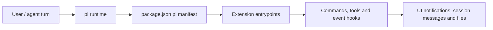

# Architecture

## Current Signals

- **Project**: @quintinshaw/pi-dynamic-workflows
- **Type**: pi-extension
- **Primary language**: TypeScript
- **Package manager**: npm
- **Detection**: pi package manifest or pi extension/theme keywords detected

## System Shape

@quintinshaw/pi-dynamic-workflows is detected as a pi-extension project written primarily in TypeScript.

The package is loaded by pi through package.json manifest entries for extensions and/or themes.

Runtime behavior is exposed through ExtensionAPI registrations such as slash commands, tools, flags, event hooks and custom session messages.

## Modules and Boundaries

- **src** — Source module inferred from repository layout. Highlights: 28 source file(s); entry point(s): src/index.ts; contracts: custom session message adversarial-review, custom session message deep-research, custom session message effort, custom session message workflow-result, custom session message workflow:${wf.name}.
- **extensions/workflow.ts** — Source module inferred from repository layout. Highlights: 1 source file(s); entry point(s): extensions/workflow.ts; contracts: pi event hook session_start.
- **tests** — Source module inferred from repository layout. Highlights: 31 source file(s); contracts: pi event hook agentEnd, pi event hook agentStart, pi event hook complete, pi event hook error, pi event hook error.
- **project-root** — Package metadata, README and top-level documentation for installing and loading the pi package. Highlights: 1 documentation file(s); entry point(s): README.md, package.json.
- **docs** — Documentation module inferred from markdown/doc files. Highlights: 1 documentation file(s).
- **.github** — Repository automation and CI/CD configuration.
- **biome.json** — Repository module inferred from file layout.
- **LICENSE** — Documentation module inferred from markdown/doc files. Highlights: 1 documentation file(s).
- **package-lock.json** — Repository module inferred from file layout.

## Inferred Decisions

- Use pi extension entrypoints instead of forking pi internals.

## Diagram

